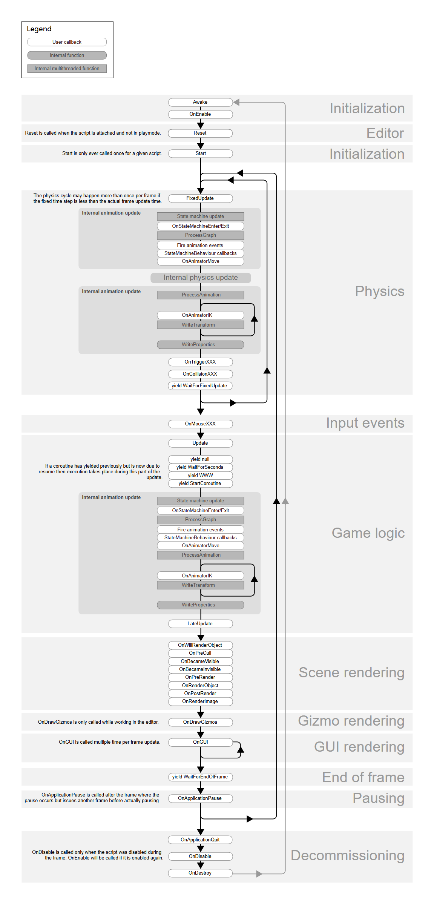

这是一个非常棒的转折点。既然你已经熟悉 Unity HLSL 和 PBR 算法，说明你的**图形学理论（算法层）**已经过关了，现在你真正缺乏的是**引擎架构（架构层）**的经验。

如果继续按照 LearnOpenGL 走，你只会把 PBR 算法用 C++ 再写一遍，代码会堆在 `main.cpp` 或者分散在零散的类里，最终变成一坨难以维护的“面条代码”。

你现在应该**停下来，不要去写光照**，转而去**重构**你的代码，构建一个微型引擎框架。

以下是你接下来的架构演进路线图（从 Unity 开发者的视角出发）：

---

### 第一阶段：消灭 `main` 函数（应用层抽象）

目前的 `main` 函数里肯定塞满了 `glfwInit`、`while` 循环、`processInput` 等。第一步是把这些封装起来。

**目标**：你的 `main.cpp` 应该只有这几行：

```cpp
#include "MyEngine/Application.h"

int main() {
    auto app = new Hamu::Application();
    app->Run(); // 内部包含 while 循环
    delete app;
}
```

**要做的事情：**
1.  **创建 `Application` 类**：它是单例的，负责持有 `Window`，管理生命周期。
2.  **创建 `Window` 类**：封装 GLFW 的初始化、回调函数注册、SwapBuffers。不要让 GLFW 的代码泄露到外面。
3.  **设计 "Main Loop"**：
    *   计算 `deltaTime`。
    *   调用 `OnUpdate()`。
    *   调用 `OnRender()`。
    *   调用 `OnImGuiRender()`。

---

### 第二阶段：层（Layer）系统与事件分发

你在 Unity 中习惯了脚本挂上去就能跑，原理是 Unity 有一套消息分发机制。你需要模仿这个。

**目标**：实现类似“洋葱圈”的层级结构。

**要做的事情：**
1.  **实现 `Layer` 基类**：
    ```cpp
    class Layer {
    public:
        virtual void OnAttach() {}
        virtual void OnDetach() {}
        virtual void OnUpdate(float ts) {} // ts = timestep/deltaTime
        virtual void OnImGuiRender() {}
        virtual void OnEvent(Event& e) {}
    };
    ```
2.  **实现 `LayerStack`**：在 `Application` 里存一个 `vector<Layer*>`。
    *   在主循环里，遍历所有 Layer 调用 `OnUpdate`。
    *   在 ImGui 渲染阶段，遍历所有 Layer 调用 `OnImGuiRender`。
3.  **分离 ImGui**：创建一个 `ImGuiLayer`，专门处理 `ImGui::NewFrame()` 和 `ImGui::Render()` 的初始化与销毁。这样你的游戏逻辑 Layer 就不需要关心 ImGui 的底层配置，只需要调 `ImGui::Button` 即可。

---

### 第三阶段：渲染器抽象（Renderer Architecture）

目前你应该是在 Update 循环里直接调用 `shader.Use()`，`glBindVertexArray`，`glDrawElements`。这是**即时渲染模式**，不易扩展。

你需要把**“要画什么（数据）”**和**“怎么画（指令）”**分开。

**目标**：
```cpp
// 在游戏逻辑里：
Renderer::BeginScene(camera);
Renderer::Submit(shader, vertexArray, transform);
Renderer::EndScene();
```

**要做的事情：**
1.  **RenderCommand 类**：封装底层的 OpenGL 调用，比如 `SetClearColor`, `Clear`, `DrawIndexed`。这样以后你想换 Vulkan/DX12，只需要换这个类。
2.  **Renderer 类**：负责统筹。
    *   `BeginScene`：接收摄像机，上传 ViewProjection 矩阵 uniform。
    *   `Submit`：接收 VAO、Shader 和 Transform 矩阵，上传 Model 矩阵，并提交绘制命令。
3.  **Material 系统（类似 Unity）**：
    *   你现在的 `Shader` 类只是 OpenGL Program 的封装。
    *   你需要一个 `Material` 类，它持有 `Shader` 的引用，并且存储了一堆 Uniform 的值（颜色、纹理、参数）。
    *   渲染时，是提交 `Material` 而不是裸的 `Shader`。

---

### 第四阶段：实体组件系统（ECS）或 GameObject

这就是你之前问的“反射”和组件系统的用武之地。

**目标**：在 ImGui 里看到一个 Hierarchy 面板，点击物体，Inspector 面板显示它的 Transform 和属性。

**要做的事情：**
1.  **引入 EnTT（推荐）**：这是一个 C++ 的 ECS 库，非常快，业界标准。不要自己手写 ECS，除非为了学习。
    *   或者手写一个简单的 `GameObject` + `Component` 系统（类似老版 Unity）。
2.  **Scene 类**：管理所有的 Entity/GameObject。
    *   `Scene::OnUpdate` 会调用所有拥有 `ScriptComponent` 的实体的 `OnUpdate`。
3.  **序列化**：引入 `YAML-CPP` 库，实现把 Scene 保存为 `.yaml` 文件，也能加载进来。这就构成了“关卡保存”功能。

---

### 第五阶段：编辑器（Editor）

利用你的 ImGui，不要只把它当 Debug 工具，而是把它做成**编辑器**。

**要做的事情：**
1.  **Framebuffer**：学会把场景渲染到一个 Texture 上，而不是直接画到屏幕。
2.  **Viewport 面板**：在 ImGui 的一个 Window 里显示上面的 Texture。这样你的游戏画面就变成了 ImGui 里的一个窗口，而不是全屏。
3.  **Docking**：启用 ImGui 的 Docking 分支，让面板可以像 Unity 一样拖拽停靠。
4.  **Guizmo**：引入 `ImGuizmo` 库，在 Viewport 窗口里实现类似 Unity 的 移动/旋转/缩放 轴操作。

---

### 总结与学习资源推荐

你现在处于**从“图形程序员”向“引擎程序员”转变**的关键期。

我强烈推荐你去 Bilibili 或者 YouTube 看 **The Cherno** 的 **Game Engine Series (Hazel Engine)**。

*   **为什么推荐？**
    *   他也是从 LearnOpenGL 的基础开始，手把手教你如何把这些散乱的代码封装成一个叫 Hazel 的游戏引擎。
    *   涵盖了我上面说的所有阶段：EntryPoint、Layer系统、Input抽象、ImGui层、Renderer架构、ECS、编辑器开发。
    *   **这对你现在的状态是 100% 对口的。** 你看了前 10 集就会有一种“原来如此，代码应该这样组织”的顿悟感。

**接下来的行动建议：**
1.  不要急着写新功能（阴影、PBR）。
2.  **Refactor（重构）**：按照“第一阶段”和“第二阶段”，把你现在的 `main.cpp` 拆解掉。建立 `Application` 和 `Layer` 系统。
3.  把 ImGui 独立成一个 Layer。
4.  当你的代码结构清晰得像 Unity 的生命周期一样时，再回头去 LearnOpenGL 把 PBR 和光照填进去，那时候你会发现只需写一个 shader 和一个 material 就搞定了，非常优雅。
   

